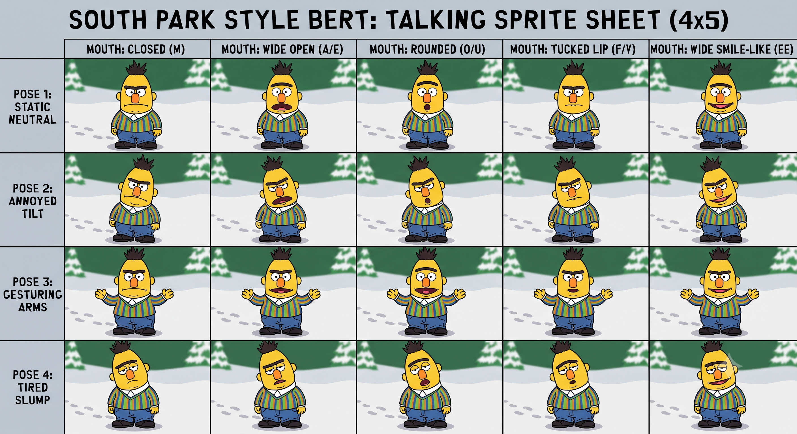

# pi-bert

An animated Bert companion for the [Pi coding agent](https://pi.dev). Bert appears in a compact top-right panel and reacts to Pi's lifecycle events.



## Behavior

| Pi state | Bert behavior |
| --- | --- |
| Idle | Neutral and ready |
| Thinking/streaming | Neutral talking animation |
| Running a tool | Gesturing talking animation with the tool name |
| Tool error | Annoyed animation for two seconds |
| Running longer than 12 seconds | Tired talking animation |
| Finished | Smiles briefly, then returns to idle |
| Waiting for a dialog response | Waits for you |
| Compacting context | Tired compacting animation |

Bert appears in a top-right overlay. Pi only allows switching between regular and fullscreen TUI modes when no overlays are registered, so `/bert off` removes Bert's overlay; use `/bert on` to restore him after switching.

## Requirements

- Pi 0.85.1 or newer
- Node.js 20 or newer
- An inline-image terminal for sprites: Ghostty, Kitty, iTerm2, WezTerm, or Warp

Other terminals receive a small text fallback.

## Installation

Install directly from GitHub:

```bash
pi install git:github.com/mitchelkuijpers/pi-bert
```

Then restart Pi.

## Try it

From a local clone of this repository:

```bash
pi -e .
```

To install from a local checkout instead:

```bash
pi install /absolute/path/to/pi-bert
```

While developing an installed local package, use `/reload` after changing the extension.

## Commands

```text
/bert                       Show Bert's current state
/bert on                    Show Bert and restore his overlay
/bert off                   Hide Bert and remove his overlay (allows TUI mode switching)
/bert animate auto          Animate only in fullscreen mode (default)
/bert animate on            Always animate the talking mouth
/bert animate off           Never animate the talking mouth
/bert test idle             Preview idle for five seconds
/bert test thinking         Preview thinking for five seconds
/bert test tool             Preview tool use for five seconds
/bert test error            Preview an error for five seconds
/bert test tired            Preview tired for five seconds
/bert test done             Preview completion for five seconds
/bert test waiting          Preview waiting for five seconds
/bert test compacting       Preview compaction for five seconds
```

## Animation and renderers

Bert's talking mouth cycles sprites every 140 ms while the agent is busy,
and by default (`animate auto`) it only runs in pi's fullscreen
(alternate-screen) mode, which re-caches image placements and handles
animation cheaply. Pi's default (main-screen) renderer deletes and
re-uploads the Kitty image data behind every changed image line, which
shows up as flickering near (or behind) the editor in terminals such as
Ghostty; there Bert still switches pose, mouth, and caption on every state
change, the frame just doesn't cycle per tick. Use `/bert animate on` to
force animation everywhere or `/bert animate off` for fully static Bert.

## Sprite generation

The committed frame images are cropped from `bert-sprites.png`. If the source sheet changes, regenerate all 20 frames with ImageMagick 7:

```bash
npm run sprites
```

The crop coordinates are documented in [`scripts/slice-sprites.sh`](scripts/slice-sprites.sh).

## Development

```bash
npm install
npm run check
```
